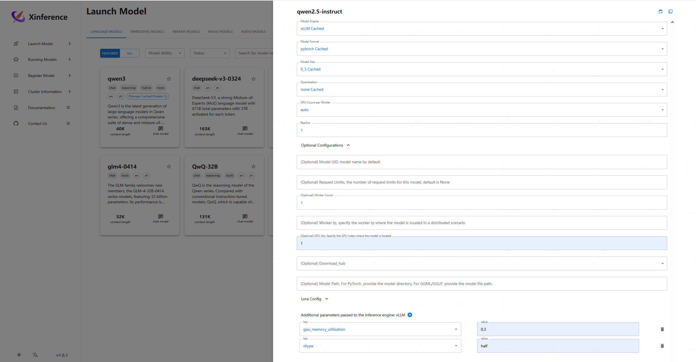
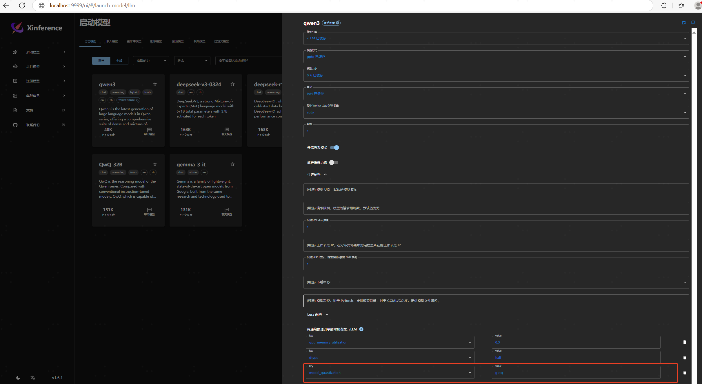
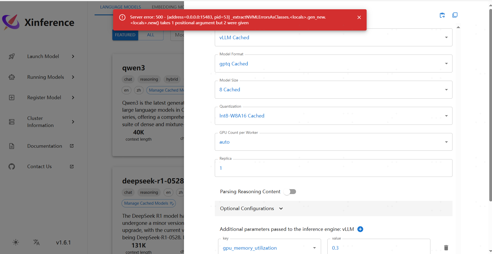

"""都开始弄rag知识问答了，那chat/embedding/rerank模型从哪儿弄呢？恩，通过本文你就可以本地部署实现模型部署自由了"""


## inference仓库介绍


| git仓库 | 地址 | 主要功能 | star/fork数
|:-|:-|:-|:-
| xinference |  [xorbitsai/inference](https://github.com/xorbitsai/inference.git) | 模型部署好助手 | 8k/679


#### 功能说明

- 项目是干啥的
  - Xinference是一个性能强大且功能全面的分布式推理框架。可用于大语言模型（LLM），语音识别模型，多模态模型等各种模型的推理。
  - 详细可查看 [xinference 指南](https://inference.readthedocs.io/zh-cn/latest/getting_started/using_xinference.html)


### xinference介绍


#### xinference安装

- 1. 接入Xinference本地大模型
    - **支持集群部署 & 通过supervisor进行管理，模型支持上下线**， 还是很方便的


```bash
# step1) pip安装环境
# pip install "xinference[vllm]" # xinference[all]
# XINFERENCE_MODEL_SRC=modelscope XINFERENCE_HOME=/tmp/xinference xinference-local --host 0.0.0.0 --port 9997

# step1) docker安装环境
docker pull xprobe/xinference:v1.6.1
cd /tmp/xinference
docker run \
    -e XINFERENCE_MODEL_SRC=modelscope \
    -e XINFERENCE_HOME=/tmp/xinference \
    -e CUDA_VISIBLE_DEVICES=1 \
    -e CUDA_DEVICE_ORDER=PCI_BUS_ID \
    --name xinference_161 \
    -v /etc/localtime:/etc/localtime \
    -v /tmp/xinference:/tmp/xinference \
    -p 9997:9997 \
    --gpus '"device=1"' \
    xprobe/xinference:v1.6.1 \
    xinference-local -H 0.0.0.0 --port 9997 --log-level debug

# step2) 启用模型
xinference launch -e http://0.0.0.0:9997 --model-name qwen2.5-instruct --model-engine vllm  --size-in-billions 0_5 --model-format gptq --quantization Int4 --gpu_memory_utilization 0.3
# 验证模型是否ok
xinference --help
xinference list # 列出所有模型
xinference engine -e http://0.0.0.0:9997 --model-name qwen2.5-instruct --model-engine vllm -f gptq # 查看模型依赖参数
# step3) 停止模型
xinference terminate --model-uid "qwen25"
# step4) 模型资源占用计算
xinference cal-model-mem -s 7 -q Int4 -f gptq -c 16384 -n qwen1.5-chat
```




- 2. xinference推理引擎对比


| 框架名称         | 推荐优先级 | 核心特点                                                                 | 适用场景                                                                 | 使用建议                                                                 |
|------------------|------------|--------------------------------------------------------------------------|--------------------------------------------------------------------------|--------------------------------------------------------------------------|
| **vLLM**         | 优先使用   | - 高吞吐连续批处理<br>- PagedAttention 显存优化<br>- 支持主流模型架构    | 生产环境部署（高并发请求）<br>需要低延迟/高吞吐的在线服务                 | 推荐场景：需要极致性能的 GPU 环境<br>注意：暂不支持非主流架构模型         |
| **SGLang**       | 优先使用   | - 复杂提示结构优化<br>- 嵌套推理加速<br>- 支持 RadixAttention 缓存复用   | 复杂提示工程（如思维链推理）<br>嵌套函数调用/多步骤交互场景               | 推荐场景：提示结构复杂的长文本生成<br>注意：需熟悉其 DSL 语法             |
| **llama.cpp**    | 其次考虑   | - 全量化支持（2-8bit）<br>- CPU/边缘设备优化<br>- 内存占用低             | 资源受限环境（如边缘设备）<br>本地 CPU 推理<br>需要超低精度量化的场景     | 推荐场景：MacBook 本地部署/树莓派等<br>注意：GPU 加速能力有限             |
| **Transformers** | 最后备选   | - 全模型架构支持<br>- 灵活定制推理逻辑<br>- 丰富的前后处理工具           | 快速实验验证<br>非主流模型架构支持<br>需要自定义推理流程的研发阶段        | 推荐场景：原型开发/学术研究<br>注意：原生性能较低，建议搭配优化技术使用   |


#### xinference方法实战


- 1. 起chat模型
    - qwen3, 需要额外指定参数 ``--model_quantization gptq``

```sh
# xinference模型挂起
export TestIP=****
export CUDA_VISIBLE_DEVICES=1
export CUDA_DEVICE_ORDER=PCI_BUS_ID
xinference launch -e http://0.0.0.0:9997 --model-name qwen3 --model-type LLM --model-engine vLLM --model-format gptq --size-in-billions 0_6 --quantization Int4 --n-gpu auto --replica 1 --n-worker 1 --gpu-idx 1  --gpu_memory_utilization 0.3 --dtype half --model_quantization gptq

# 手动vllm起
export CUDA_VISIBLE_DEVICES=1
python3 -m vllm.entrypoints.openai.api_server --model /tmp/xinference/modelscope/hub/Qwen/Qwen3-0___6B-GPTQ-Int8/ --trust-remote-code  --host 0.0.0.0 --port 8002 --served-model-name qwen3-06B-Chat --max-model-len 22000 --gpu_memory_utilization 0.3 --dtype half

# 服务测试
curl -X 'POST' http://$TestIP:9999/v1/chat/completions \
  -H 'accept: application/json' \
  -H 'Content-Type: application/json' \
  -d '{
    "model": "qwen2.5-instruct",
    "messages": [
        {
            "role": "system",
            "content": "You are a helpful assistant."
        },
        {
            "role": "user",
            "content": "What is the largest animal?"
        }
    ]
  }'
```





- 2. 起embedding模型

```sh
#部署 bge-large-zh embedding
xinference launch --model-name bge-large-zh-v1.5 --model-type embedding --replica 1 --n-gpu auto --gpu-idx 1 --download-hub modelscope

curl -X 'POST' \
    http://$TestIP:9999/v1/embeddings \
    -H 'accept: application/json' \
    -H 'Content-Type: application/json' \
    -d '{
      "model": "stella-mrl-large-zh-v3.5-1792d",
      "input": "What is the capital of China?"
    }'
```


- 3. 起rerank模型

```sh
#部署 bge-reranker-large rerank
xinference launch --model-name bge-reranker-base --model-type rerank --replica 1 --n-gpu auto --gpu-idx 1


curl -X 'POST' \
    http://$TestIP:9999/v1/rerank \
    -H 'accept: application/json' \
    -H 'Content-Type: application/json' \
    -d '{
      "model": "bge-reranker-base",
      "query": "A man is eating pasta.",
      "documents": [
          "A man is eating food.",
          "A man is eating a piece of bread.",
          "The girl is carrying a baby.",
          "A man is riding a horse.",
          "A woman is playing violin."
      ]
    }'
```


### FQA


#### vllm模型启用失败

- 1. 问题明细

```sh
TypeError: [address=0.0.0.0:41589, pid=65] _extractNVMLErrorsAsClasses.<locals>.gen_new.<locals>.new() takes 1 positional argument but 2 were given
```

- 2. 复现方式
    - web页面启用模型





- 3. 解决方式
    - 详细为pynvml代码问题，具体可参考 [pynvml导致vllm错误](https://github.com/vllm-project/vllm/issues/12906)
    - 首先，修改 nvml.py 文件的new函数，定位真实问题
    - 其次，下载 [pynvml#7a3be22](https://github.com/ray-project/ray/blob/master/python/ray/_private/thirdparty/pynvml/pynvml.py) 覆盖到vllm下
    - 如果还是不行， **就试下重启大法，重新生成容器时不对GPU做任何筛选操作**


```sh
# step1
pip show pynvml
cd /usr/local/lib/python3.10/dist-packages/pynvml
vim nvml.py

...
def gen_new(val):
    def new(typ, *args): # <-- change here, add `, *args` to make it accept various arguments
        print(args)
        obj = NVMLError.__new__(typ, val)
        return obj
    return new


# step2，把从ray里面下载的pynvml替换下面文件
cp **/pynvml.py /usr/local/lib/python3.10/dist-packages/vllm/third_party/pynvml.py
```


## 环境说明 


- 1. 环境说明

```sh
ubuntu1~20.04.2
NVIDIA Quadro 8000
CUDA Version: 12.5
Driver Version: 535.183.01
docker: 20.10.14
Python 3.10.14
```

- 2. python环境
    - python库版本，请看requirements_env.txt

```sh
vllm==0.8.5
xinference==1.6.1
bitblas==0.1.0
```